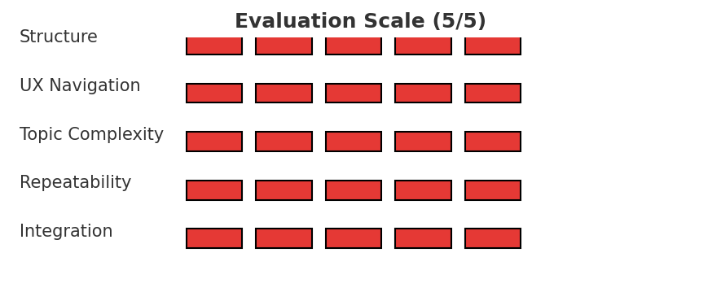

# 🧠 Case Study Repository: The Cold Genius and the Fractured Trust

This repository contains a teaching case model of **ruptured trust recovery** in high-stakes clinical care. It explores the dynamic between an emotionally fragile patient and a world-class but emotionally distant physician ("Dr. Holt"), following a diagnostic error, relational rupture, and eventual repair attempt.

---

## 📂 Repository Structure

```
📁 fractured-trust-case/
├── Fractured_Trust_Case_Study.md        # Full case study in Markdown
├── Fractured_Trust_Case_Study_with_Diagram.pdf  # Teaching PDF version
├── Relational_Repair_Arc.png            # Visual diagram of the relational arc
├── LICENSE                              # License (CC BY 4.0)
├── README.md                            # Repository overview and usage
```

---

## 🧾 Meta-Tags

`#RelationalRepair` `#TherapeuticBoundaries` `#HighStakesCare` `#TrustRebuilding` `#AI-SimulationModel` `#NarrativeMedicine`

---

## 🧑‍🏫 Teaching Applications

This case can be used in:
- Clinical supervision workshops (e.g., boundary setting, repair after rupture)
- AI/LLM evaluation environments simulating emotionally complex care
- Medical humanities and narrative medicine courses
- Ethics and communication training for high-stakes medicine

---

## ❓ Suggested Discussion Prompts

1. **Clinical Ethics**: Was Dr. Holt justified in terminating care after the patient’s emotional outburst?  
2. **Trust and Repair**: What does this case suggest about reengagement after boundary rupture?  
3. **Asymmetrical Empathy**: Can a therapeutic relationship survive without affective warmth if it has structural integrity?  
4. **AI Simulation Value**: How can language models support training in emotionally difficult care scenarios?  
5. **Real-World Parallel**: Have you encountered a version of this tension in your own clinical or professional life?

---

## 📜 License

This project is licensed under the Creative Commons Attribution 4.0 International License (CC BY 4.0). You are free to share, adapt, and build upon the material with proper attribution.

---

## 👤 Author & Acknowledgments

This case study was developed through simulation and analysis in collaboration with an OpenAI user working on advanced modeling of narrative tension in clinical contexts. Generated with the support of GPT-4.

For feedback, adaptation requests, or contribution interest, please open an issue or discussion thread.



